# 基于springboot的飘香水果购物网站

<h4 style='color:red'>联系不到我，就看我的主页 </h4> 
 
#### 介绍

飘香水果购物网站是一个基于Spring Boot框架开发的电子商务平台，专注于提供新鲜水果的在线购买服务。该系统集成了丰富的功能模块，支持管理员和用户两种角色，以满足不同用户的需求。通过智能化的管理系统，飘香水果购物网站致力于为用户提供便捷、安全、愉悦的购物体验。

#### 技术栈

后端技术栈：Springboot+Mysql+Maven

前端技术栈：Vue+Html+Css+Javascript+ElementUI

开发工具：Idea+Vscode+Navicate

#### 系统功能介绍

管理员功能模块：

个人中心：管理员可在此模块中管理个人信息、查看操作日志、设置密码等。  
用户管理：管理用户账户，包括添加、编辑、删除用户信息，以及设置用户权限。  
会员管理：设置会员等级、优惠规则，以及管理会员权限和权益。  
会员卡管理：定义会员卡类型、优惠内容，以及查看和管理会员卡使用情况。  
开通会员记录管理：记录并管理用户开通会员的详细信息。  
积分管理：设置积分规则，查看和管理用户积分变动情况。  
水果管理：添加、编辑、删除水果信息，设置水果分类，管理库存等。  
购买水果订单管理：查看、处理用户提交的订单，包括确认、发货、完成等状态管理。  
积分兑换记录管理：管理用户的积分兑换请求，审核并处理兑换结果。  
加积分记录管理与减积分记录管理：记录并管理用户积分增加和减少的详细情况。  

用户功能模块：  

会员卡：查看会员卡信息、优惠内容，以及开通或续费会员卡。  
水果：浏览水果列表，查看水果详情，搜索并购买所需水果。  
水果新闻：获取最新的水果资讯和新闻，了解水果市场动态。  
个人中心：管理个人信息、查看订单历史、管理积分等。  
开通会员记录管理：查看自己的会员开通记录，以及续费会员。  
积分管理：查看自己的积分余额，了解积分变动情况。  
购买水果订单管理：查看自己的订单状态，包括待支付、待发货、已发货、已完成等。  
积分兑换记录管理：查看自己的积分兑换记录，发起新的积分兑换请求。  

#### 系统作用

飘香水果购物网站通过整合线上购物、会员服务、积分兑换等功能，为用户提供了全方位的购物体验。对于用户而言，他们可以方便地浏览和购买各种新鲜水果，享受会员优惠和积分兑换服务；对于管理员而言，他们可以高效地管理用户、会员、水果信息和订单，确保网站的正常运营和用户体验的优化。同时，该系统还通过数据分析功能，为管理员提供了销售、用户行为等方面的数据支持，帮助他们更好地了解市场需求和用户需求，为经营决策提供有力支持。

#### 系统功能截图

代码结构

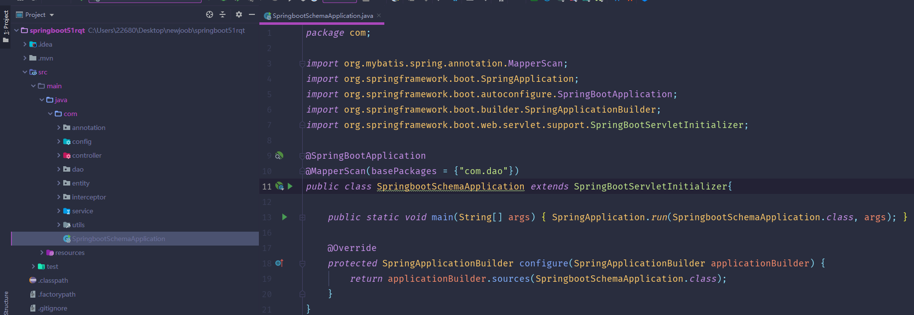

数据库表

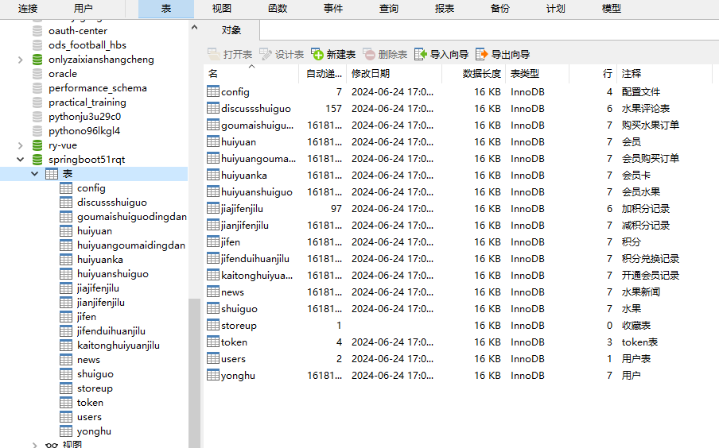

登录

用户管理

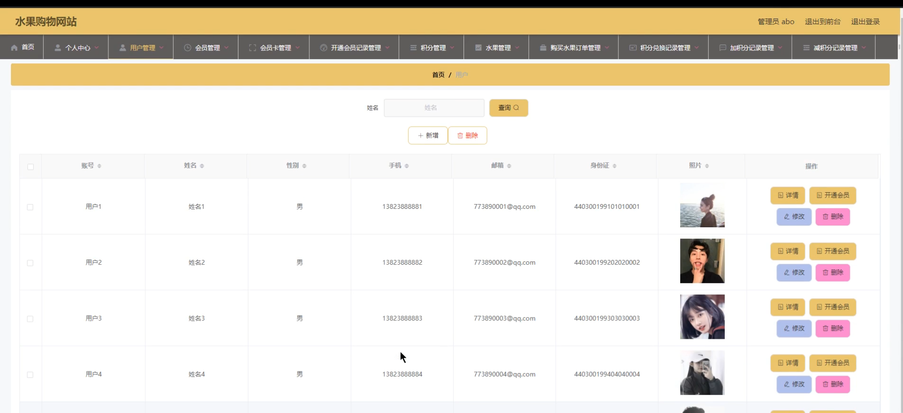

会员管理

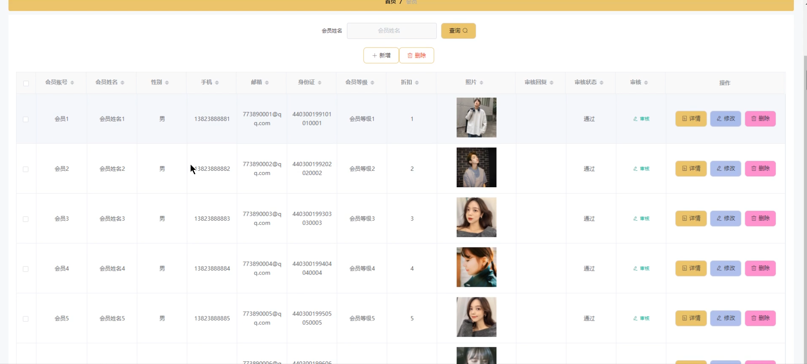

积分管理

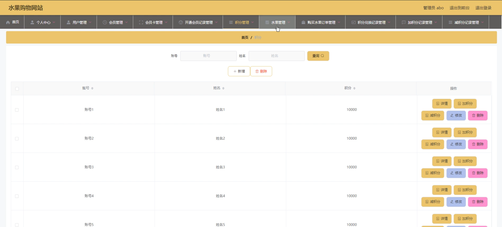

水果管理

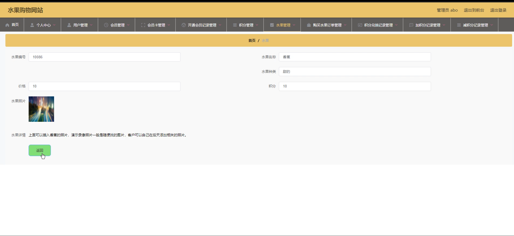

会员水果管理

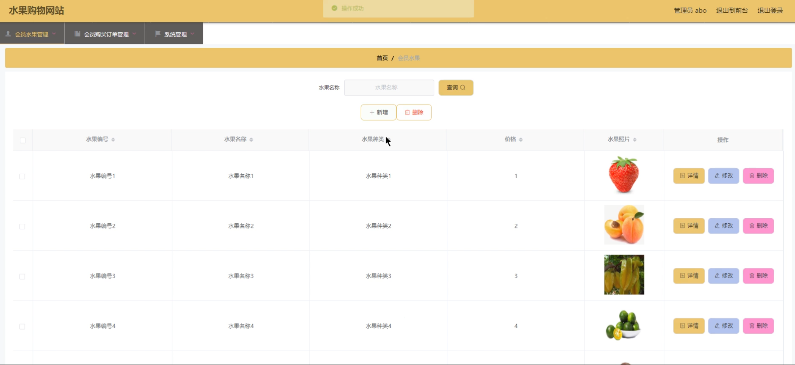

前台页面

个人中心

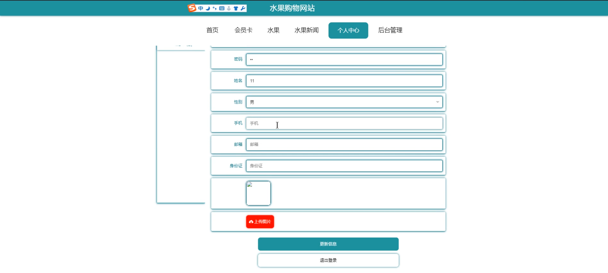

用户端后台管理

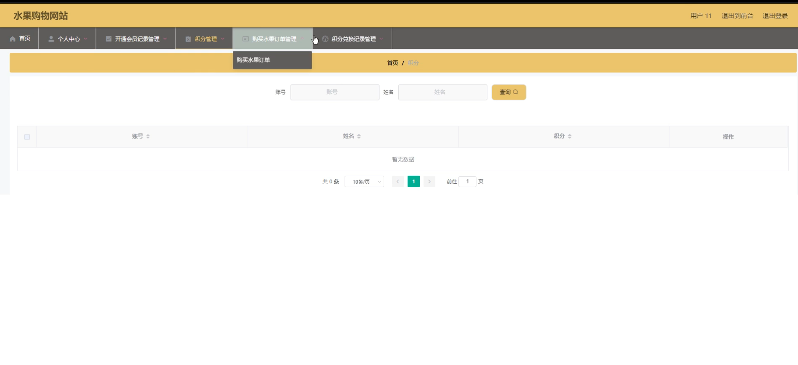

积分兑换记录管理

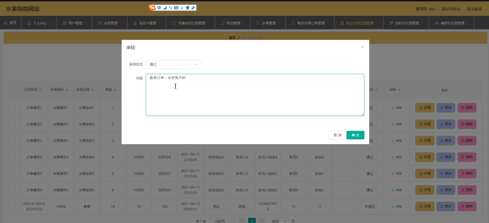

会员端支付

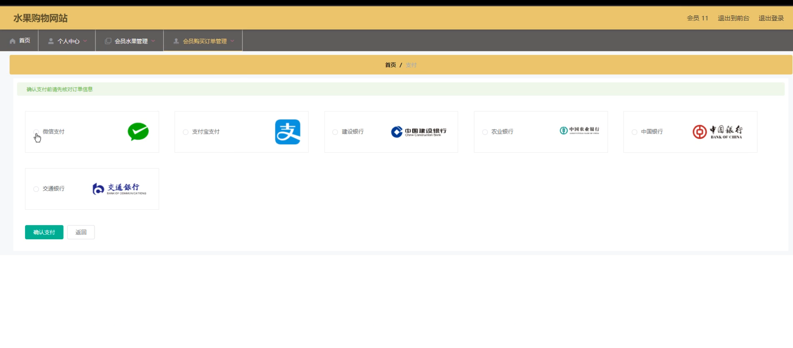

#### 总结

飘香水果购物网站是一个功能丰富、操作便捷的电子商务平台。通过Spring Boot框架的开发和智能化管理系统的应用，该系统为用户和管理员提供了高效、安全、愉悦的服务体验。未来，随着技术的不断发展和市场需求的不断变化，飘香水果购物网站将继续优化和扩展系统功能，为用户提供更加优质的服务。

#### 使用说明

创建数据库，执行数据库脚本 修改jdbc数据库连接参数 下载安装maven依赖jar 启动idea中的springboot项目

后台地址：http://localhost:8080/springboot51rqt/admin/dist/index.html

管理员  abo 密码 abo

前台地址：http://localhost:8080/springboot51rqt/front/index.html

